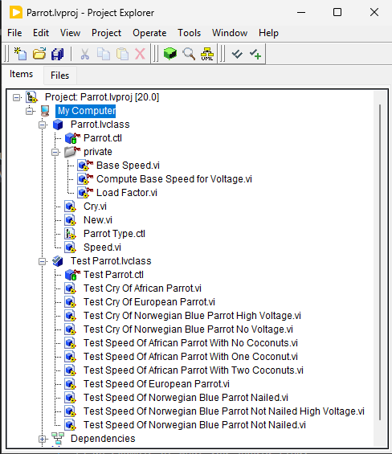
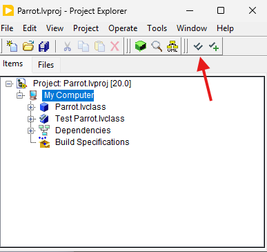
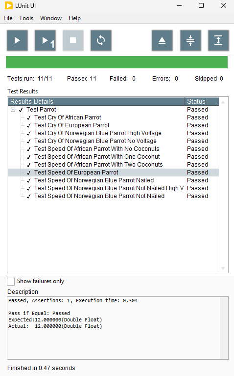
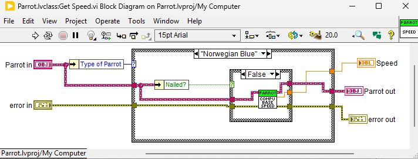

# Parrot Refactoring Kata
=======================

This is a LabVIEW implementation of the Parrot kata originally by Emily Bache. 

## Getting Started

You will need LabVIEW version 2020 or later installed. There is a community edition available. It is free. You do need to have an `ni.com` account though. Here is a [link to download the Community Edition](https://www.ni.com/en/support/downloads/software-products/download.labview-community.html#570612). When installing, in the list of options, be sure to select VI Package Manager (VIPM).

Once you clone the repository there is a `.vipc` file in the root directory. If you double click on that, it will open up in VIPM and prompt you to install the dependencies (which as I am writing this consists of simply the LUnit Testing Framework). Follow the prompts and it should install everything you need.

You may get a popup about LabVIEW Versions. If so, select the correct correct LabVIEW version from the dropdown and then under tools select Apply Package Configuration.

Once you have all the dependencies installed, simply doubleclicking the `.lvproj` file in the root directory should open everything up in LabVIEW. It should look something like this:

To run the tests, click on the green checkmark in the row of icons at the top of the project explorer:

You should then see a window like this:

After that feel free to explore the project. Each of the `.vi` files is the equivalent of a function in a text-based language. When you open one, you'll see gray colored GUI, hit Ctrl+E to go to the corresponding block diagram. Here is an example of what you should find:

## Instructions/Examples

Can you spot any code smells in this code? I'll give you a clue - a spot of Pol(l)ymorphism (Dynamic Dispatch in LabVIEW Terms) should improve matters!

Refactor this code, take small steps, run the tests often. See how small and beautiful and polymorphic you can make it.

Emily made a [video explaining this kata](https://youtu.be/UxNEHKg_2eA), and another [video with a worked solution in C#](https://youtu.be/IvFX8Ivit1k). Here are videos of me going through the kata: [part 1](https://youtu.be/rLG31R4A2_0) and [part 2](https://youtu.be/qQhuEqjv4pU).

## Acknowlegements
---------------

This code is heavily inspired by one of the examples in Martin Fowler's book "Refactoring". It's a classic, and if it's not on your bookshelf already I suggest you treat yourself to a copy!
